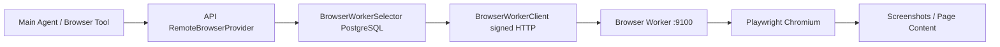

# Browser Worker Production Runtime

本文档记录当前真实服务器上的 Browser Worker 正式运行链路。它面向主 agent、RAG 知识库和运维，不把未完成能力写成已完成能力。

## 当前结论

截至 2026-05-28，Browser Worker 已从 mock browser 切换为真实 `remote` provider 基线：

- API 侧配置为 `BROWSER_PROVIDER=remote`。
- 本机 Browser Worker 监听 `0.0.0.0:9100`，实际运行 `worker/main.py`。
- Worker 后端使用 Playwright Chromium。
- Worker strict auth 已开启，未签名请求会被拒绝。
- API 与 Worker 使用同一份服务器私有 `BROWSER_WORKER_SHARED_SECRET` / `BROWSER_WORKER_SECRET`，文档不记录明文。
- 已注册 Windows 开机任务 `AI Ops Browser Worker`。

仍未完成：

- OpenClaw 仍是 mock provider，本轮没有把社媒发布能力声明为真实可用。
- API 当前未在 8000 端口运行，因此本轮未把本机 worker 写入数据库 worker 注册表。API 启动后仍需在目标 workspace 下登记 worker。

## 运行链路



Provider 只会选择数据库中 `status=online` 且能力匹配的 worker。只启动 9100 进程还不等于主 agent 一定能调用，必须完成 worker 注册。

## 关键配置

服务器 `.env` 中当前 Browser 相关正式值：

```env
BROWSER_PROVIDER=remote
BROWSER_WORKER_AUTH_ENABLED=true
BROWSER_WORKER_AUTH_STRICT=true
BROWSER_WORKER_SHARED_SECRET=<server-private-secret>
BROWSER_ALLOWED_DOMAINS=douyin.com,v.douyin.com,open.douyin.com,iesdouyin.com,amemv.com,localhost,127.0.0.1
BROWSER_ALLOW_EXTERNAL_DOMAINS=false
```

Worker 进程启动时会把 `BROWSER_WORKER_SHARED_SECRET` 映射为 `BROWSER_WORKER_SECRET`。两侧密钥必须一致，否则 API 请求会被 worker 以 401 拒绝。

## Windows 脚本

启动或重启 Browser Worker：

```powershell
powershell.exe -NoProfile -ExecutionPolicy Bypass -File deployment\windows\start_browser_worker_aiops.ps1 -Force
```

注册开机任务：

```powershell
powershell.exe -NoProfile -ExecutionPolicy Bypass -File deployment\windows\register_browser_worker_aiops_task.ps1
```

验证运行时：

```powershell
powershell.exe -NoProfile -ExecutionPolicy Bypass -File deployment\windows\verify_browser_worker_aiops.ps1
```

验证脚本执行三类检查：

- `GET /health` 返回 Playwright worker 且 `browser_runtime=true`。
- 未签名 `POST /browser/session/create` 在 strict auth 下返回 401。
- 签名请求可以创建并关闭真实 browser runtime session。

## API Worker 注册

API 启动后，用目标 workspace 注册本机 worker。示例：

```powershell
powershell.exe -NoProfile -ExecutionPolicy Bypass -File deployment\windows\register_browser_worker_with_api.ps1 -WorkspaceId "<workspace-id>"
```

该脚本会先检查 `http://127.0.0.1:9100/health`，再调用 API 注册接口。也可以手动调用：

```powershell
$headers = @{ "X-Workspace-Id" = "<workspace-id>" }
$body = @{
  worker_name = "local-browser-worker"
  worker_type = "playwright"
  base_url = "http://127.0.0.1:9100"
  capabilities = @{
    browser = "chromium"
    browser_runtime = $true
    screenshot = $true
    page_content = $true
    click = $true
    type_text = $true
    scroll = $true
    persistent_profile = $true
  }
  metadata = @{
    runtime = "windows-single-server"
    managed_by = "AI Ops Browser Worker scheduled task"
  }
  max_sessions = 5
  max_actions_per_minute = 60
  priority = 100
  allowed_domains = @("douyin.com", "v.douyin.com", "open.douyin.com", "iesdouyin.com", "amemv.com", "localhost", "127.0.0.1")
  generate_secret = $true
} | ConvertTo-Json -Depth 8

Invoke-RestMethod `
  -Uri "http://127.0.0.1:8000/api/v1/browser-workers/register" `
  -Method Post `
  -Headers $headers `
  -ContentType "application/json" `
  -Body $body
```

`generate_secret=true` 时，API 会优先使用 `BROWSER_WORKER_SHARED_SECRET` 计算并保存 worker secret hash。这样 API 重启后仍可用同一共享密钥签名请求，不依赖进程内临时缓存。

## Phase 68W 更新：正式注册对齐

生产单服务器基线使用 `production-workspace`，与 `deployment/profiles/production-server/healthchecks.json` 保持一致。

当本机直接运行 `worker.main:app` 并监听 `127.0.0.1:9100` 时，不要同时运行 Docker `aiops-browser-worker` 容器占用同一端口。Docker 保留给 API/Postgres/Redis/Qdrant，客户机 worker 入口由宿主机进程提供。由于 API 当前运行在 Docker 容器内，注册到 API 的 `worker_base_url` 应使用 `http://host.docker.internal:9100`；本机直接验证才使用 `http://127.0.0.1:9100`。

正式本机 worker 配置保存在 Git 忽略的 `worker_client/worker_config.yaml`；API 注册返回的一次性明文 `worker_secret` 保存在 Git 忽略的 `worker_client/worker_state.json`。这两个文件不提交、不打印 secret。

标准注册路径：

```powershell
.\.venv\Scripts\python.exe -m worker_client.cli --config worker_client\worker_config.yaml register --force
.\.venv\Scripts\python.exe -m worker_client.cli --config worker_client\worker_config.yaml heartbeat --once
```

Windows API 注册脚本也会写入同一份 state：

```powershell
powershell.exe -NoProfile -ExecutionPolicy Bypass -File deployment\windows\register_browser_worker_with_api.ps1 -WorkspaceId "production-workspace" -WorkerName "aiops-production-browser-worker"
```

创建 config/state 后重启宿主机 worker：

```powershell
powershell.exe -NoProfile -ExecutionPolicy Bypass -File deployment\windows\start_browser_worker_aiops.ps1 -Force
```

重启和注册后的 `GET /local/status` 应返回：

- `worker_name=aiops-production-browser-worker`
- `workspace_id=production-workspace`
- `registered=true`
- `runtime_running=true`

启动脚本现在只会停止 Python `worker.main:app` 进程。若端口由 Docker/WSL 占用，需要显式停止对应容器或服务，脚本不会直接杀掉平台基础设施。

## 安全边界

- `/health` 可公开用于本机健康检查；创建 session、动作执行、截图、页面读取、关闭 session 和 human-control worker 控制面都需要签名。
- `BROWSER_ALLOW_EXTERNAL_DOMAINS=false` 时，只允许 `BROWSER_ALLOWED_DOMAINS` 中的域名。
- 当前 worker 不提供登录托管、验证码处理、指纹绕过、代理池、cookie 注入或社媒发布编排。
- OpenClaw 社媒发布能力必须由后续真实 worker/runtime 补齐，不能复用本 Browser Worker 文档替代。

## 已验证命令

```powershell
.\.venv\Scripts\python.exe -m pytest tests\test_reranker_client.py tests\test_reranker_worker_runtime.py tests\test_production_config.py tests\test_worker_signed_requests.py tests\test_real_browser_worker_service.py tests\test_remote_worker_playwright_flow.py -q
powershell.exe -NoProfile -ExecutionPolicy Bypass -File deployment\windows\verify_browser_worker_aiops.ps1
.\.venv\Scripts\python.exe scripts\check_production_config.py --json --report-only
docker compose config --quiet
```

结果：

- 目标测试：15 passed。
- Browser Worker 运行时验证：PASS。
- 生产审计：Browser 相关 error 已清零；剩余 blocking error 为 `OPENCLAW_PROVIDER=mock`。
