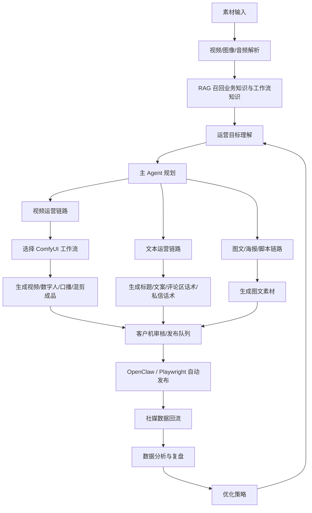

# 商业 AI 运营闭环架构

更新日期：2026-05-28

## 目标

本工程的目标不是只做 KTV 视频，也不是只做 ComfyUI 渲染工具，而是建立一套可复用的商业运营自动化闭环：

> 素材理解 -> 运营目标规划 -> Agent 选择执行链路 -> 内容生成 -> 客户机发布 -> 数据回流 -> 分析优化 -> 下一轮迭代。

KTV 商业视频只是一个垂直业务样例。后续同一套架构应支持餐饮、本地生活、品牌号、企业号、课程、招聘、直播切片、电商带货等不同项目。

## 总流程

## 阶段说明

### 1. 视频解析

输入可以是：

- 用户上传的视频素材。
- 参考爆款视频。
- 门店/产品/人物素材。
- 已发布账号历史视频。

视频解析不应直接依赖单一“视频大模型”。推荐拆成多模态管线：

- 视频抽帧：提取关键帧、场景切换、镜头节奏。
- 图像理解：用 VLM 分析画面内容、人物、场景、产品、构图、灯光。
- 音频识别：用 ASR 提取口播、音乐、环境音。
- OCR/字幕识别：提取画面文字、标题、字幕。
- 节奏分析：统计镜头时长、转场、字幕密度、口播节奏。
- LLM 汇总：生成结构化视频分析报告。

输出应包括：

- `scene_summary`
- `shot_list`
- `visual_style`
- `audio_script`
- `subtitle_text`
- `editing_pattern`
- `hook_structure`
- `call_to_action`
- `replicable_workflow_hints`

### 2. 运营目标理解

系统需要把客户目标转成运营任务，而不是直接生成内容。

常见目标：

- 拉新获客。
- 到店转化。
- 品牌曝光。
- 私域导流。
- 招商加盟。
- 团购套餐转化。
- 老客复购。
- 直播预热。

输出：

- 目标人群。
- 平台渠道。
- 内容类型。
- 转化动作。
- 风格边界。
- 合规边界。
- 成本/时效要求。

### 3. Agent 规划

主 Agent 负责判断应该进入哪条执行链路。

可选链路：

- 文本运营：标题、脚本、评论区话术、私信话术、活动文案。
- 视频运营：分镜、数字人、混剪、图生视频、口播、动作迁移。
- 图文运营：海报、笔记、小红书图文、封面。
- 数据运营：复盘、A/B 测试、选题优化、投放建议。

主 Agent 不直接写 ComfyUI 节点，而是根据 RAG 知识选择合适的工作流模板，并生成参数契约。

### 4. ComfyUI 工作流选择

ComfyUI 工作流文档应作为 RAG 知识库，内容只描述每个工作流的能力：

- 工作流名称。
- 适用场景。
- 输入类型。
- 输出类型。
- 核心节点。
- 依赖模型。
- 质量优势。
- 风险和限制。
- 适合哪些项目类型。

Agent 根据运营任务自动选择：

- 数字人口播：选择 InfiniteTalk / S2V 类工作流。
- 人物动作迁移：选择 Wan2.2 Animate / SAM3 / KJ 流。
- 场景视频生成：选择图生视频或多图视频工作流。
- 素材处理：选择 SAM、MatAnyone、BiRefNet、DepthAnything、音频分离等工具流。
- 声音生成：选择 Qwen TTS、Index TTS、LongCat TTS。

### 5. 成品输出

输出不是单个文件，而是一组可发布资产：

- 视频成品。
- 封面。
- 标题。
- 简介文案。
- 话题标签。
- 评论区首评。
- 私信转化话术。
- 发布平台配置。
- 审核报告。

所有输出都应记录：

- 使用的素材。
- 使用的工作流。
- 使用的模型。
- 生成参数。
- 成本和耗时。
- 质检结果。

### 6. 客户机发布

客户机负责连接真实平台环境。

发布工具：

- OpenClaw。
- Playwright。
- 平台后台或网页发布入口。

发布前必须有审核/授权边界：

- 账号授权。
- 内容审核。
- 发布时间确认。
- 平台合规检查。
- 失败重试策略。

### 7. 数据回流

发布后系统拉回社媒数据：

- 播放量。
- 完播率。
- 点赞。
- 评论。
- 转发。
- 收藏。
- 私信。
- 表单/团购/到店线索。
- 粉丝变化。
- 评论语义。

数据应绑定到：

- 项目。
- 运营目标。
- 发布内容。
- 工作流版本。
- 素材版本。
- Agent 决策版本。

### 8. 分析优化

分析 Agent 根据数据判断：

- 哪类开头有效。
- 哪类人物形象有效。
- 哪类话术有效。
- 哪类视频结构带来转化。
- 哪个工作流产出的内容更稳定。
- 哪些素材应继续复用。
- 哪些内容应停止。

输出下一轮优化：

- 新选题。
- 新脚本。
- 新镜头结构。
- 新发布时间。
- 新封面标题。
- 新工作流参数。

## 当前工程对应关系

已有基础：

- LLM Client Layer：`app/agents/providers/`
- 本地 LLM 配置：`.env` 中 `LLM_PROVIDER=local`
- 数字人导演计划：`app/digital_humans/creative_planner.py`
- 数字人任务/审批/执行：`app/digital_humans/service.py`
- 商业视频主 Agent 入口：`POST /api/v1/commercial-operations/{operation_id}/video-agent-orchestration`
- ComfyUI 受控执行：`app/api/routes/comfyui_runtime.py`
- ComfyUI_cu130 工作流资产：`E:\ComfyUI_cu130\ComfyUI\user\default\workflows`

待补齐：

- 视频解析服务：抽帧 + VLM + ASR + OCR + LLM 汇总。
- ComfyUI 工作流 RAG 入库。
- Agent 到 ComfyUI 工作流的自动选择和参数填充。
- 客户机发布执行器与审批边界。
- 社媒数据回流和效果归因。
- 基于数据的持续优化 Agent。

## 文档分工

后续文档应拆分为三类：

1. 系统架构文档：描述闭环、模块、数据流、边界。
2. 工作流知识文档：只描述每个 ComfyUI 工作流的作用和适用场景，供 RAG 检索。
3. 项目执行文档：针对某个客户或行业，比如 KTV、餐饮、门店、课程，描述具体策略。

`COMFYUI_CU130_WORKFLOW_GUIDE.md` 应属于第二类，不应混入单一项目的执行方案。
