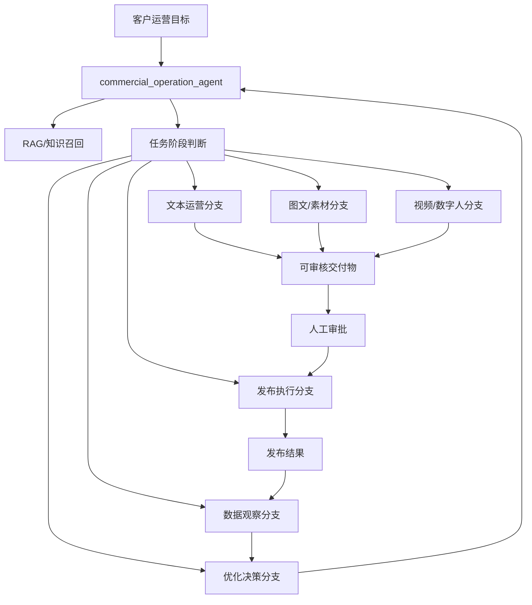

# 全局运营主 Agent 架构

更新日期：2026-05-28

本文档用于纠正一个关键方向：系统的主线不是“商业视频生成”，而是“商业运营闭环”。视频只是内容生产分支之一，和文本、图文、音频、投放、客户机发布、数据分析、下一轮优化处于同一套全局 Agent 编排之下。

## 核心定位

全局主 Agent 应该叫：

```text
commercial_operation_agent
```

它的职责不是亲自生成视频，也不是亲自操作 ComfyUI，而是：

1. 理解客户的运营目标。
2. 判断当前任务处于哪个运营阶段。
3. 调用 RAG 获取业务知识、产品资料、平台规则、历史数据和工作流知识。
4. 决定应该走文本、图文、视频、数字人、发布、数据分析还是优化分支。
5. 把任务交给对应专业 Agent。
6. 维护审批、执行、结果、观察、优化的闭环状态。

## 总体结构



## 现有工程里已经存在的全局骨架

当前工程并不是没有全局 Agent，已有一个基础版在：

[app/commercial_operations/service.py](D:/ai-operations-system/app/commercial_operations/service.py)

方法：

```text
CommercialOperationService.get_agent_skill_orchestration()
```

它现在返回的是一个确定性 Agent/Skill 编排视图，包括：

| Skill | Owner Agent | 作用 |
|---|---|---|
| `operation_intake_skill` | `commercial_operation_agent` | 记录运营目标 |
| `task_planning_skill` | `commercial_operation_agent` | 拆解任务计划 |
| `knowledge_retrieval_skill` | `rag_agent` | 召回知识 |
| `content_generation_skill` | `content_agent` | 生成文本/内容草稿 |
| `approval_gate_skill` | `review_agent` | 人工审核 |
| `client_execution_skill` | `client_execution_agent` | 客户机执行交接 |
| `result_recording_skill` | `publish_result_agent` | 发布结果记录 |
| `data_observation_skill` | `analytics_agent` | 数据观察 |
| `analysis_improvement_skill` | `analytics_agent` | 优化分析 |
| `next_cycle_content_skill` | `content_agent` | 下一轮内容 |

这才是项目全局主线。视频 Agent 应该挂在 `content_generation_skill` 或 `asset_generation_skill` 下面，而不是替代全局主 Agent。

## 全局主 Agent 应有的决策层

全局主 Agent 的核心输出应该是 `OperationRoutingDecision`。

```json
{
  "operation_id": "uuid",
  "current_stage": "content_production",
  "operation_goal": "为本地生活商家持续生成并发布获客内容",
  "recommended_track": "video_content",
  "selected_agents": [
    "rag_agent",
    "content_strategy_agent",
    "video_agent",
    "review_agent"
  ],
  "reason": "当前目标需要产出短视频素材，且已有场景素材和参考视频。",
  "required_inputs": [
    "business_profile",
    "target_platform",
    "source_materials",
    "workflow_knowledge"
  ],
  "blocked_by": [
    "video_analysis_model_not_verified"
  ],
  "next_action": "先生成视频方案和工作流候选，不启动 ComfyUI 渲染。"
}
```

## 专业 Agent 分层

### 1. 运营策略 Agent

```text
operation_strategy_agent
```

负责：

- 目标拆解
- 人群定位
- 卖点提炼
- 渠道策略
- 成功指标定义

### 2. RAG Agent

```text
rag_agent
```

负责检索：

- 客户业务资料
- 产品/门店资料
- 平台规则
- 历史投放数据
- ComfyUI 工作流知识
- 成功案例和失败案例

### 3. 内容策略 Agent

```text
content_strategy_agent
```

负责决定内容形式：

- 文本运营
- 图文笔记
- 短视频
- 数字人视频
- 直播脚本
- 私域话术
- 广告素材
- 数据报告

### 4. 文本内容 Agent

```text
text_content_agent
```

负责：

- 标题
- 文案
- 口播脚本
- 评论区话术
- 私信话术
- 活动说明

### 5. 视觉素材 Agent

```text
visual_asset_agent
```

负责：

- 海报需求
- 封面需求
- 商品图需求
- 场景图需求
- 素材清理
- 图片工作流选择

### 6. 视频 Agent

```text
video_content_agent
```

负责：

- 参考视频解析
- 分镜结构学习
- 短视频脚本
- 数字人视频规划
- ComfyUI 视频工作流选型
- 视频执行包生成

视频 Agent 只是内容生产分支之一，不应该成为全局主 Agent。

### 7. 工作流选择 Agent

```text
workflow_selection_agent
```

负责把任务需求匹配到工具/工作流：

- ComfyUI 工作流
- OpenClaw 动作
- Playwright 发布流程
- 文档/表格/报告生成流程
- 数据分析流程

当前新增的 `cu130_workflow_rag_documents.jsonl` 和 `select_comfyui_workflows.py` 应该归到这一层。

### 8. 审核 Agent

```text
review_agent
```

负责：

- 风险检查
- 质量门
- 品牌一致性
- 肖像/素材授权
- 发布前人工确认

### 9. 客户机执行 Agent

```text
client_execution_agent
```

负责：

- 生成客户机执行包
- 调用 OpenClaw/Playwright
- 处理账号登录、页面状态、失败恢复
- 返回执行记录

### 10. 数据分析 Agent

```text
analytics_agent
```

负责：

- 发布数据回流
- 评论/私信/线索分析
- 内容表现对比
- 优化假设
- 下一轮内容建议

## 正确的全局流转

```text
运营目标
  -> commercial_operation_agent
  -> RAG 召回业务与历史知识
  -> content_strategy_agent 判断内容形式
  -> text/video/visual/publishing/analytics 专业分支
  -> review_agent 审核
  -> client_execution_agent 发布或执行
  -> analytics_agent 数据回流
  -> commercial_operation_agent 开启下一轮
```

## 视频分支在全局里的位置

视频分支只在以下条件触发：

1. 运营目标明确需要短视频、数字人、口播、素材视频、直播切片。
2. 平台是抖音、视频号、小红书视频、快手、TikTok 等。
3. 数据分析显示视频内容比文本/图文更适合当前目标。
4. 用户显式要求参考视频、生成视频或复刻视频结构。

如果目标是：

- 私域转化
- 评论区运营
- 朋友圈文案
- 小红书图文
- 活动方案
- 数据复盘
- 客户回访
- 销售话术

则不应该进入视频主链路。

## 下一步工程改造建议

### 第一阶段：把全局 Agent 状态显式化

在现有 `get_agent_skill_orchestration()` 基础上，新增或扩展：

```text
OperationRoutingDecision
OperationTrack
SelectedSpecialistAgent
RequiredKnowledgeCollections
NextExecutableContract
```

目标是让全局主 Agent 返回“为什么走这个分支”，而不是只返回当前阶段状态。

### 第二阶段：把视频 Agent 降级为专业分支

保留：

```text
POST /api/v1/commercial-operations/{operation_id}/video-agent-orchestration
```

但它应该由全局主 Agent 决定是否调用，而不是成为默认主入口。

### 第三阶段：引入 workflow_selection_agent

把以下资产接入全局工作流选择层：

```text
deployment/comfyui/commercial_ktv_workflow/cu130_workflow_rag_documents.jsonl
scripts/select_comfyui_workflows.py
```

后续不仅可以选 ComfyUI 视频流，也可以扩展到：

- 图片流
- 音频流
- 文本生成流
- 发布流
- 数据分析流

### 第四阶段：建立统一执行包

不管是视频、图文、文本还是发布，都应该输出统一的执行包：

```json
{
  "track": "video_content | text_content | visual_asset | client_publish | analytics",
  "selected_agent": "video_content_agent",
  "selected_workflow": "optional",
  "input_assets": [],
  "parameters": {},
  "approval_required": true,
  "execution_boundary": "metadata_only | guarded_runtime | client_machine"
}
```

### 第五阶段：让数据闭环反哺全局主 Agent

数据回流后，不应该直接只优化视频参数，而应该先回到全局主 Agent：

```text
数据结果 -> analytics_agent -> optimization_decision -> commercial_operation_agent
```

然后由全局主 Agent 判断下一轮该做：

- 换标题
- 换发布时间
- 换脚本
- 换视频工作流
- 改成图文
- 改成私域话术
- 调整目标人群
- 暂停某渠道

## 当前判断

当前工程状态应该重新定义为：

> 已有商业运营闭环骨架，视频 Agent 是新增的专业分支。下一步重点不是继续加视频能力，而是增强 `commercial_operation_agent` 的全局路由能力，让它能决定何时使用文本、图文、视频、发布、分析和优化分支。
